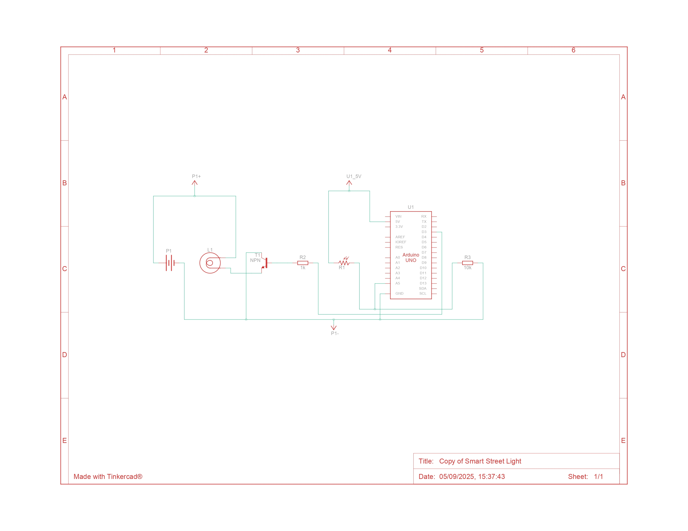
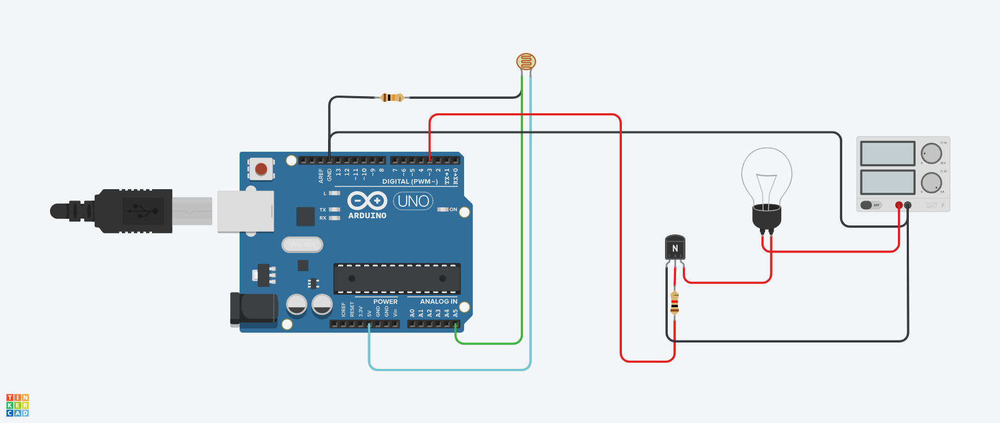

# Smart Street Light

This project demonstrates a simple automation loop using an Arduino Uno, an LDR, and a transistor-driven lamp or LED. It is the best opening build for the workshop because students can see sensor input and output control with very little code.

## Project Preview

## Quick Links

- Sketch: [src/smart_street_light/smart_street_light.ino](./src/smart_street_light/smart_street_light.ino)
- Pinout guide: [pinout.md](./pinout.md)
- Troubleshooting guide: [troubleshooting.md](./troubleshooting.md)
- Bill of materials: [bom.csv](./bom.csv)
- Reference PDF: [docs/smart-street-light-guide.pdf](./docs/smart-street-light-guide.pdf)

## Learning Outcomes

- understand how an LDR behaves as an analog input
- read brightness values using `analogRead()`
- switch an output with threshold logic
- observe how hysteresis reduces flickering
- explain a simple automation workflow from sensor to actuator

## Simulation Access

- Build in Tinkercad: [tinkercad.com/circuits](https://www.tinkercad.com/circuits)
- Public project share link: not published yet

Use the local circuit images, [`pinout.md`](./pinout.md), and [`bom.csv`](./bom.csv) to recreate the workshop circuit quickly.

## Core Components

| Component | Quantity | Notes |
| --- | --- | --- |
| Arduino Uno R3 | 1 | Main controller |
| Photoresistor (LDR) | 1 | Measures ambient light |
| NPN transistor | 1 | Switches the lamp or LED safely |
| Lamp or LED load | 1 | Represents the street light |
| 1 kOhm resistor | 1 | Limits base current into the transistor |
| 10 kOhm resistor | 1 | Sets the LDR divider behavior |

## How To Run

1. Rebuild the circuit using the images in [`media/`](./media/) and the table in [`pinout.md`](./pinout.md).
2. Open [`src/smart_street_light/smart_street_light.ino`](./src/smart_street_light/smart_street_light.ino) in Arduino IDE or paste it into Tinkercad text mode.
3. Start the simulation or upload the sketch to a physical Arduino Uno.
4. Open the Serial Monitor at `9600` baud.
5. Change the light level and watch the lamp state update.

## Expected Behavior

- When the surroundings become dark, the street light turns on.
- When the surroundings become bright again, the light turns off.
- The Serial Monitor prints the live LDR value and current street light state.

## Troubleshooting Highlights

- If the lamp never turns on, confirm the transistor wiring and the LDR divider.
- If the lamp flickers, check that the LDR is connected to the correct analog pin and review the thresholds.
- If nothing appears in the Serial Monitor, verify the baud rate is `9600`.

See the full troubleshooting notes in [troubleshooting.md](./troubleshooting.md).

## Related Files

- Workshop root: [README.md](../../../README.md)
- Simulation index: [../README.md](../README.md)
