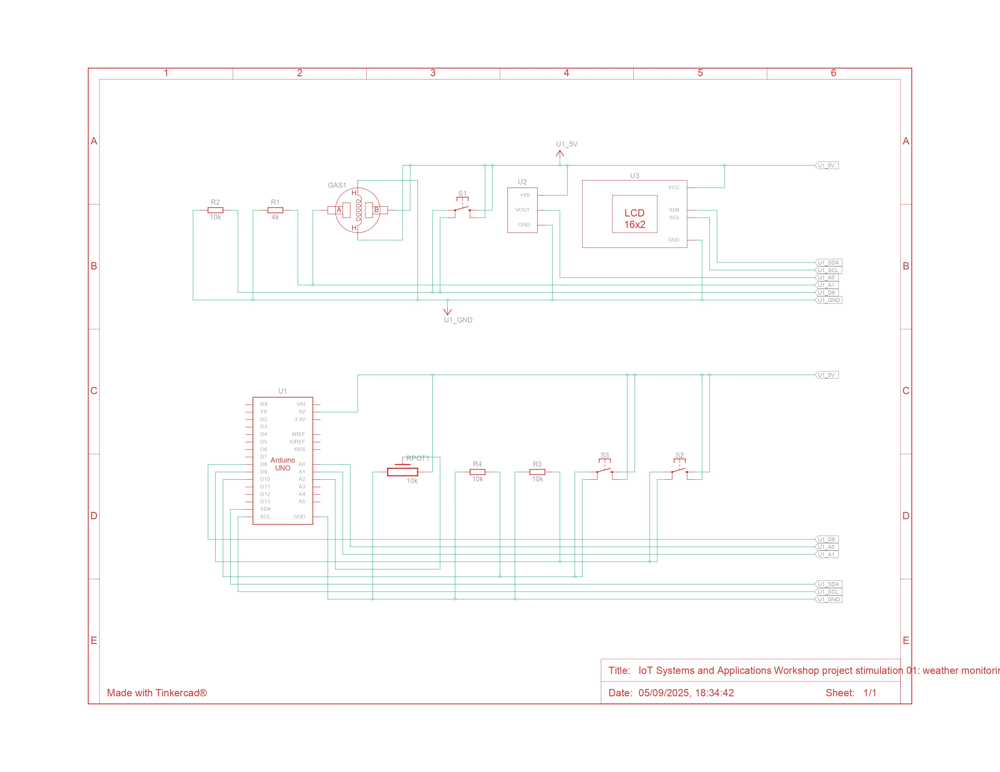
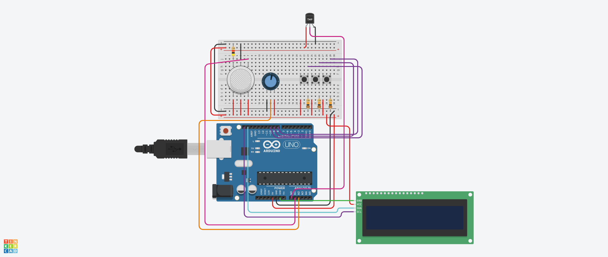

# Weather Station

This project simulates a classroom-friendly weather station using Arduino Uno, a TMP36 temperature sensor, a gas sensor, a potentiometer for humidity simulation, and a 16x2 LCD with an I2C backpack.

## Project Preview

## Quick Links

- Sketch: [src/weather_station/weather_station.ino](./src/weather_station/weather_station.ino)
- Pinout guide: [pinout.md](./pinout.md)
- Troubleshooting guide: [troubleshooting.md](./troubleshooting.md)
- Bill of materials: [bom.csv](./bom.csv)
- Reference PDF: [docs/weather-station-guide.pdf](./docs/weather-station-guide.pdf)
- Public simulation: [Open the public weather station simulation](https://www.tinkercad.com/things/7MCBJ2HEQz6-project-stimulation-02-weather-monitoring-station?sharecode=VNVADSSn7aQBaEI5H3D-EuOWA37Xi6T7O1XbTCPMKGM)

## Learning Outcomes

- build a multi-input Arduino project
- switch between display modes using pushbuttons
- read analog sensor data and map it to user-friendly values
- present measurements on a character LCD
- explain how one controller can manage multiple sensor views

## Core Components

| Component | Quantity | Notes |
| --- | --- | --- |
| Arduino Uno R3 | 1 | Main controller |
| TMP36 temperature sensor | 1 | Temperature input |
| Gas sensor | 1 | Air-quality style analog reading |
| Potentiometer | 1 | Simulates humidity change |
| LCD 16x2 with I2C backpack | 1 | Displays the current mode and reading |
| Pushbuttons | 3 | Changes the active display mode |

## How To Run

1. Recreate the circuit from the images in [`media/`](./media/) and the table in [`pinout.md`](./pinout.md).
2. Open [`src/weather_station/weather_station.ino`](./src/weather_station/weather_station.ino) in Arduino IDE or Tinkercad text mode.
3. Start the simulation or upload the sketch to a physical Arduino Uno.
4. Press one of the three mode buttons.
5. Adjust the sensors and observe the LCD and Serial Monitor output.

## Display Modes

- Temperature mode: shows temperature in Celsius with a simple condition label
- Air quality mode: shows the raw gas sensor reading
- Humidity mode: maps the potentiometer to a percentage value

## Troubleshooting Highlights

- If the LCD is blank, confirm the I2C LCD wiring and library setup.
- If no mode changes happen, verify the three button connections to `D8`, `D9`, and `D10`.
- If readings never change, move the TMP36, gas sensor, or potentiometer in the simulation and check the Serial Monitor.

See the full troubleshooting notes in [troubleshooting.md](./troubleshooting.md).

## Related Files

- Workshop root: [README.md](../../../README.md)
- Simulation index: [../README.md](../README.md)
